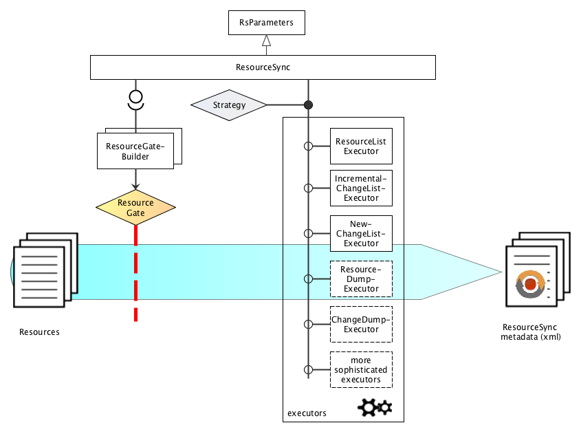

# rspub-core
Core Python library for ResourceSync publishing

## Overview



## Quick install

### Running from source
Clone or downoad the source code. If your editor does not install required packages, issue the pip install
command from the root directory of this project.
```
$ cd your/path/to/rspub-core
$ pip install -r requirements.txt
```

