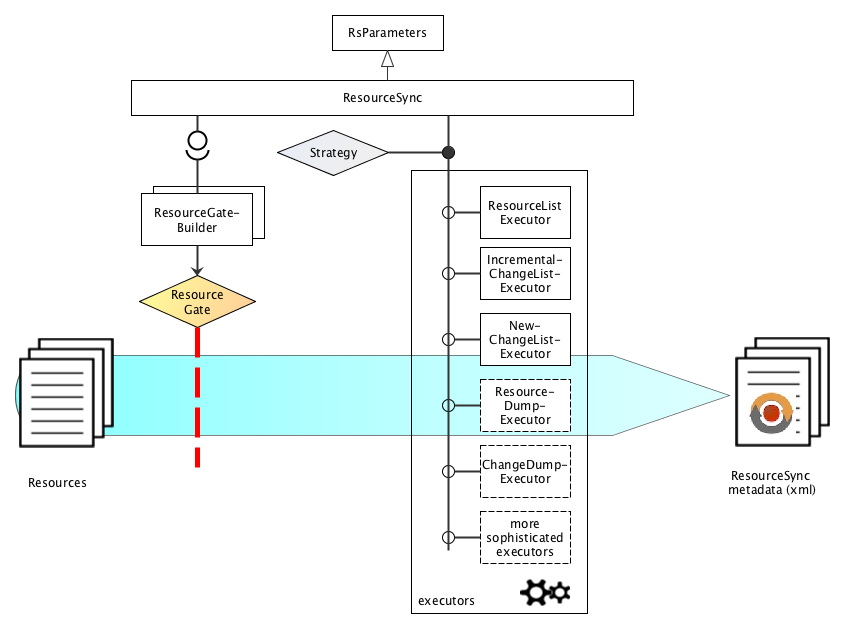

# rspub-core
[](http://rspub-core.readthedocs.io/en/latest/?badge=latest)

Core Python library for ResourceSync publishing

---
- The component in this repository is intended to be used by developers.
- Source location: [https://github.com/EHRI/rspub-core](https://github.com/EHRI/rspub-core)
- Source documentation: [http://rspub-core.readthedocs.io/en/latest/](http://rspub-core.readthedocs.io/en/latest/)
- In case of questions [contact](https://github.com/EHRI/rspub-core/issues/new) the EHRI team.

---

## Introduction
The [ResourceSync specification](http://www.openarchives.org/rs/1.0.9/resourcesync) describes 
a synchronization framework for the web consisting of various capabilities that allow third-party systems to remain synchronized with a server's evolving resources.
More precisely the ResourceSync Framework describes the communication between `source` and `destination` aimed at
synchronizing one or more resources. Communication uses `http` and an extension on 
the [Sitemap protocol](http://www.sitemaps.org/protocol.html), an xml-based format for expressing metadata, relevant for synchronization.

The software in the `rspub-core` library handles the `source`-side implementation of the framework.
Given a bunch of resources it analyzes these resources and the differences over time and creates
the necessary sitemap-documents that describe the resources and the changes. 

## Overview



_Fig. 1. Overview of the main features of rspub-core._

In essence rspub-core is a one-class, one-method library: class _ResourceSync_, method _execute_.
But there is more:

- RsParameters control the conditions under which the execution takes place. Parameters can
be saved as configuration and restored from disk.
- The selection of resources is done by a ResourceGate that works with one-argument
predicates. How exactly the ResourceGate is 


## Quick install

### Running from source
Clone or downoad the source code. If your editor does not install required packages, issue the pip install
command from the root directory of this project.
```
$ cd your/path/to/rspub-core
$ pip install -r requirements.txt
```

