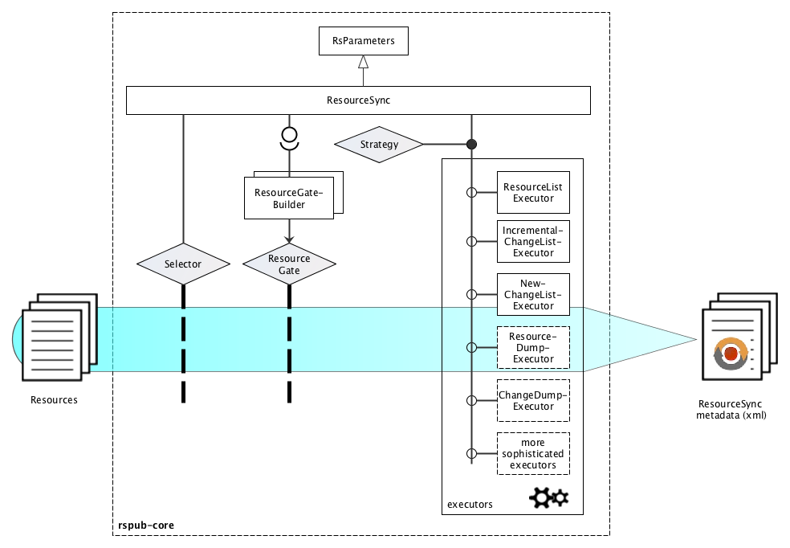

# rspub-core
[](http://rspub-core.readthedocs.io/en/latest/?badge=latest)

Core Python library for ResourceSync publishing

---
- The component in this repository is intended to be used by developers and/or system administrators.
- Source location: [https://github.com/EHRI/rspub-core](https://github.com/EHRI/rspub-core)
- Source documentation: [http://rspub-core.readthedocs.io/en/latest/](http://rspub-core.readthedocs.io/en/latest/)
- There is also a GUI based on _rspub-core_. See [https://github.com/EHRI/rspub-gui](https://github.com/EHRI/rspub-gui)
- In case of questions [contact](https://github.com/EHRI/rspub-core/issues/new) the EHRI team.

---

## Introduction
The [ResourceSync specification](http://www.openarchives.org/rs/1.0.9/resourcesync) describes 
a synchronization framework for the web consisting of various capabilities that allow third-party systems to remain synchronized with a server's evolving resources.
More precisely the ResourceSync Framework describes the communication between `source` and `destination` aimed at
synchronizing one or more resources. Communication uses `http` and an extension on 
the [Sitemap protocol](http://www.sitemaps.org/protocol.html), an xml-based format for expressing metadata, relevant for synchronization.

The software in the `rspub-core` library handles the `source`-side implementation of the framework.
Given a bunch of resources it analyzes these resources and the differences over time and creates
the necessary sitemap-documents that describe the resources and the changes. 

## Overview



_Fig. 1. Overview of the main features of `rspub-core`._

In essence rspub-core is a one-class, one-method library: class `ResourceSync`, method `execute`.
But there is more:

- `RsParameters` control the conditions under which the execution takes place. Multiple sets of parameters can
be saved as configurations and restored from disk.
- The set of resources that will be synchronized can be selected and filtered in several ways:
    - The `execute` method in the `ResourceSync` class takes a file, a folder, or a list of files and folders as
    argument.
    - It can also take a `Selector`. The `Selector` class is a simple implementation of a filter based on
    included and excluded path names. Just like configurations,
    selectors can be saved and they can be associated with a configuration.
    - Complementary to the above mentioned execution arguments, there is a pluggable `ResourceGate`.
    A `ResourceGate` defines sets of including and excluding one-argument predicates. The one argument for the
    predicates is the absolute filename of the inspected resource. A predicate can take decisions
    not only based on filename patterns but also based on contents or validity of, or additional metadata on a resource.
    You can define your own taste of `ResourceGate` by plugging-in a `ResourceGateBuilder`.
- The chosen `Strategy` determines what kind of process will do the synchronization. At the moment there are `Executors`
that produce _resourcelists_, _new changelists_ or _incremental changelists_.

A set of parameters, known as a configuration, can precisely define a set of resources, the selection and filter
mechanisms, the publication strategy and where to store the resourcesync metadata. Dedicated configurations can be defined
for multiple sets of resources and published in equal amounts of _capabilitylists_. A configuration can be saved on disk,
restored and run with a minimum effort. This makes `rspub-core` the ideal library for scripting a publication
strategy that will serve multiple groups of consumers that may be interested in different sets of resources offered
by your site.

The command line interface [rspub/cli/rscli.py](http://rspub-core.readthedocs.io/en/latest/rst/rspub.cli.rscli.html) was originally
used to balance and clearly define the API of the core library. You may use it in a window-less environment
to compose, save and run configurations. Based on `rspub-core` the project [rspub-gui](https://github.com/EHRI/rspub-gui)
offers a graphical user interface to publish resources.

## Quick install

### Running from source
Clone or downoad the source code. If your editor does not install required packages, issue the pip install
command from the root directory of this project.
```
$ cd your/path/to/rspub-core
$ pip install -r requirements.txt
```
In order to make use of command line completion in the command line interface you will also need the optional
requirement `gnureadline`:
```
$ pip install -r requirements_opt.txt
```

